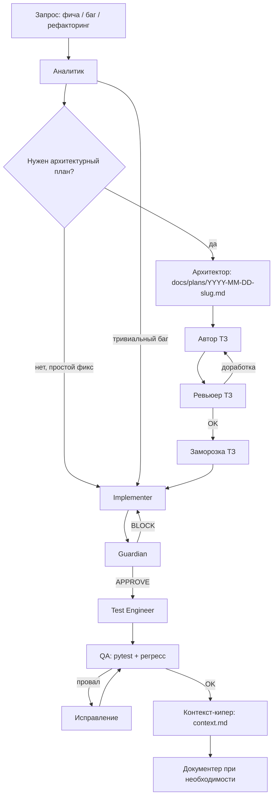

# Воркфлоу разработки HR 1-2-1 Web

Порядок согласован с этапами: анализ → проектирование → ТЗ → проверка ТЗ → реализация → тесты → прогон и регресс → актуализация `context.md`.

## Роли (агенты)

| Роль | Ответственность |
|------|-----------------|
| **Аналитик** | Формулировка проблемы, обзор кода и API, риски, открытые вопросы |
| **Архитектор** | Варианты решения, границы изменений, риски, откат → файл в `docs/plans/` |
| **Автор ТЗ** | Цели, сценарии, критерии приёмки, нефункциональные требования → `docs/specs/` |
| **Ревьюер ТЗ** | Полнота, отсутствие противоречий, тестируемость критериев |
| **Implementer** | Код по утверждённому ТЗ, минимальный дифф |
| **Guardian** | Безопасность, обработка ошибок, соответствие ограничениям проекта |
| **Test Engineer** | Автотесты (юнит + API с моками внешних сервисов при необходимости) |
| **QA / Tester** | `pytest`, регресс по чек-листу, ручной смоук по `README` |
| **Контекст-кипер** | Обновление `context.md` после значимых изменений |
| **Документер** | `README` и прочая пользовательская документация при изменении поведения |

## Поток работ

## Обязательные артефакты

| Этап | Артефакт |
|------|----------|
| Архитектура | `docs/plans/YYYY-MM-DD-<slug>.md` — цель, шаги, риски, миграции, rollback |
| ТЗ | `docs/specs/<feature>-tz.md` или версионное имя — требования и критерии приёмки |
| Реализация | Краткий change-log в описании PR: что / где / почему / как проверить |
| Guardian | Вердикт APPROVE или BLOCK с пунктами |
| Тестирование | Список проверенного и шаги воспроизведения |
| Завершение | Обновление `context.md` |

## Эскалации

- **Guardian BLOCK** → исправления → повторный обзор; при повторном BLOCK — пересмотр плана архитектором.
- **Регрессия после тестов** → отладка → повтор прогона; при системной ошибке в ТЗ — возврат к автору/ревьюеру ТЗ.

## Классификация задач

1. Новая функция — полный поток с планом и ТЗ (если не тривиальная).
2. Багфикс — анализ → фикс → Guardian → тесты; план — по необходимости.
3. Рефакторинг без смены поведения — анализ → изменения → тесты регрессии → `context.md` при смене структуры.

## Ограничения (напоминание)

- Не коммитить секреты (`.env`, ключи, пароли).
- Логи без секретов и без лишних персональных данных.
- Явная обработка ошибок; не оставлять «пустые» except.
